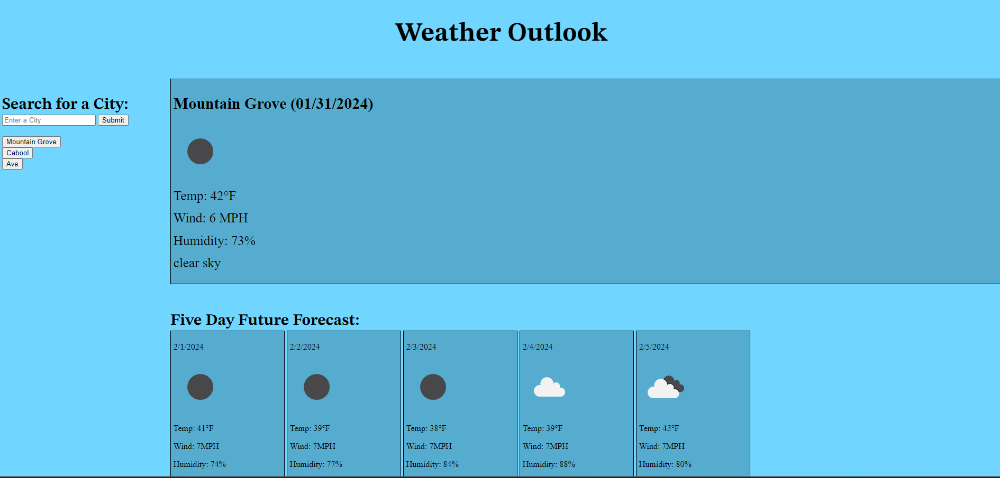

# Weather Dashboard

## Current and Future Weather Information

This project is a weather dashboard that allows a user to enter a city name and get current weather information along with the forecast for the next five days. The user will receive the following information about each location:

- City Name provided by the user
- current date
- an icon representing the current weather
- current temperature
- current wind speed
- current humidity
- current weather description
- the next five days of forecasted weather with the same info as the current day

When the user presses the submit button, the weather information is displayed, the city name is stored in a local storage, and a button is created to show it has been searched.
If the user has previously searched for places, the recent searches will automatically be displayed under recent searches when the page is located. If the user clicks on a previously searched button, the button will move to the top of the searches list and display current weather information.

I challenged myself to use the following new concepts in my project:

- using information from an API
- creating elements to append to the Dom
- adding unique ids to created elements
- parsing and stringifying arrays for local storage
- nullish coalescing operator to handle null information
- grid layout for CSS

If I were to continue this project I would like to add the following features:

- change theme (light/daytime, dark/nighttime) using sunrise and sunset times for that location
- Distinguishing cities with the same name
- a way to handle misspelled names

## Credits

I used the following resources during this project:

- MDN Documentation
- W3Schools
- My instructors, Eli and Ian
- Open Weather Documentation
- Cloud recordings of class
- Previous projects
